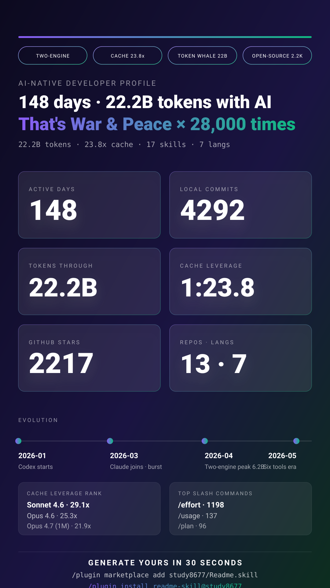

<div align="center">

# Readme.skill

### Turn your local AI coding history into a shareable developer card — in 30 seconds.

Reads your real Claude Code / Codex CLI / Kiro (AWS) / Trae (ByteDance) / Gemini Antigravity (Google) / Cursor usage data, generates a **shareable, redacted-by-default AI-Native developer profile** — a long-form report **and** a vertical poster you can post anywhere.

[](https://github.com/study8677/Readme.skill/stargazers)
[](https://github.com/study8677/Readme.skill/network/members)
[](https://github.com/study8677/Readme.skill/issues)
[](./LICENSE)
[](./.claude-plugin/plugin.json)
[](https://www.ruanyifeng.com/blog/2026/05/weekly-issue-395.html)
[](https://linux.do/)

🌐 [中文版](./README.md) · **English**　|　[📥 Install](#-install-in-30-seconds) · [🎬 What it looks like](#-what-the-output-looks-like) · [❓ FAQ](#-faq) · [🗺️ Roadmap](#-roadmap)

</div>

---

<p align="center">
  <a href="./examples/profile_20260528_en.md">
    
  </a>
</p>

<p align="center">
  <em>↑ Latest real run on the author's machine, v2.5.1 (148 days · 22.21B tokens · 23.8× cache leverage · 2,217★ · 4 AI tools in parallel).</em><br/>
  <em>Click for the full <a href="./examples/profile_20260528_en.md">English profile</a> · <a href="./examples/profile_20260528.md">中文版</a>.</em>
</p>

---

## ✨ What you get

- **A long-form report** ([sample](./examples/profile_20260515_en.md)) — 10 dimensions, narrative-driven: AI-native practice / Cache leverage / Session architecture / Token economics / Evolution curve / Project domains …
- **A vertical poster** ([sample SVG](./examples/poster_20260515_en.svg)) — 1080×1920, six hero numbers + AI-written verdict line + identity badges + one-line install CTA. Post it to X / LinkedIn / Mastodon as-is.
- **100% local**: zero network calls except `gh` (your own GitHub). Zero uploads. Zero writes to `~/.claude` or `~/.codex`.
- **Redacted by default**: project names become "Project A/B/C", private repos become `Private Repo X`, API keys / tokens / emails scrubbed via OWASP-style regex.
- **One-line trigger**: install once, say "build my AI usage profile" — the agent runs nine steps and hands you both files.

## 🎯 Who this is for

| You are | What you'd use it for |
| --- | --- |
| **A developer job-hunting** | Pin a real picture of how you collaborate with AI on top of your GitHub profile — **stronger than "proficient with AI tools" on any resume** |
| **An AI-native practitioner** | Quantify your cache leverage, multi-model orchestration, self-built skill count — things you can't easily prove in an interview |
| **Doing year-end / weekly reviews** | One run gets you the 149-day heatmap + Evolution curve + working rhythm. Recap material, done. |
| **A creator on X / LinkedIn / Substack** | The poster ships three built-in viral pieces (verdict + badges + install CTA). Sharing loop closes itself. |
| **A team tech lead** | Have your team each run one — discover AI best practices, not just best workers. |

## ⚡ Install in 30 seconds

### Option 0: Claude Code Plugin (recommended — two lines)

Inside Claude Code:

```
/plugin marketplace add study8677/Readme.skill
/plugin install readme-skill@study8677
```

Claude Code auto-discovers `skills/readme-skill/SKILL.md` and mounts it. No manual symlinking.

### Option 1: Clone + symlink (Codex CLI users, or skipping plugins)

```bash
git clone https://github.com/study8677/Readme.skill.git
cd Readme.skill

# Claude Code
mkdir -p ~/.claude/skills/readme-skill
ln -sf "$(pwd)/skills/readme-skill/SKILL.md" ~/.claude/skills/readme-skill/SKILL.md

# Codex CLI
mkdir -p ~/.codex/skills/readme-skill
ln -sf "$(pwd)/skills/readme-skill/SKILL.md" ~/.codex/skills/readme-skill/SKILL.md
```

<details>
<summary>Option 2, Option 3 (direct copy / one-line curl)</summary>

```bash
# Option 2: direct copy
git clone https://github.com/study8677/Readme.skill.git
mkdir -p ~/.claude/skills/readme-skill
cp Readme.skill/skills/readme-skill/SKILL.md ~/.claude/skills/readme-skill/
# Codex: mkdir -p ~/.codex/skills/readme-skill && cp ... ~/.codex/skills/readme-skill/

# Option 3: one-line curl
mkdir -p ~/.claude/skills/readme-skill && curl -fsSL https://raw.githubusercontent.com/study8677/Readme.skill/main/skills/readme-skill/SKILL.md -o ~/.claude/skills/readme-skill/SKILL.md
# Codex: replace ~/.claude with ~/.codex
```

</details>

## 🎬 Use it

In Claude Code or Codex, say any of:

- "build my AI usage profile"
- "summarize my Claude / Codex history"
- "make me an AI-native README"
- "generate my AI profile" / "生成我的 AI 档案"
- "analyze my Claude usage"

The AI runs the full pipeline and writes `output/profile_<date>_en.md` for English requests, or `output/profile_<date>.md` for Chinese/default. Poster goes to `output/poster_<date>_<lang>.svg`.

### Shareable vs private mode

- **Default (shareable)** — project names → "Project A/B/C", private repos → "Private Repo X".
- **Private** — say "private version / show real names / 私人版", real names kept (still scrubs API keys / emails).

## 🌐 Supported AI coding tools

| Tool | Status | Data source |
| --- | --- | --- |
| **Claude Code** | ✅ Full support | `~/.claude/stats-cache.json` + `history.jsonl` + `projects/*/*.jsonl` + plans + skills + settings |
| **Codex CLI** | ✅ Full support | `~/.codex/state_5.sqlite` (read-only) + `history.jsonl` + skills + automations + rules |
| **Kiro (AWS)** | ✅ v2.5 added | `~/.kiro/sessions/cli/*.{json,jsonl}` + `~/.local/share/kiro-cli/data.sqlite3` + `~/.kiro/{agents,skills,steering,prompts,settings}` |
| **Trae (ByteDance)** | ⚠️ v2.5 partial | `~/Library/Application Support/Trae/User/{workspaceStorage,globalStorage}/state.vscdb` (chat metadata, read-only) + workspace `.trae/{rules,skills}`. **Token usage is held by cloud API; this skill stays offline, so token numbers will be missing by default.** |
| **Gemini Antigravity (Google)** | ✅ v2.5 added (community PR [#1](https://github.com/study8677/Readme.skill/pull/1)) | `~/.gemini/antigravity/brain/<uuid>/`: per-task `*.metadata.json` + `task.md` / `implementation_plan.md` / `walkthrough.md`. **Tokens unavailable** — task/artifact counts + text-scale estimate (non-billing) only. |
| **Cursor (Anysphere)** | ⚠️ v2.5.1 added (partial) | `~/Library/Application Support/Cursor/User/{workspaceStorage,globalStorage}/state.vscdb` `composer.*` / `aiService.*` keys (VS Code fork, same architecture as Trae) + workspace `.cursor/{rules,mcp.json}` / `.cursorrules`. **Authoritative tokens are in cloud dashboard**, local-only estimates are reference. |
| **GitHub** | ✅ Public contributions | `gh api graphql` — 365-day contributions, top repos, languages |
| **Local git** | ✅ Full support | Read-only `git log` in each project, counts commits / +- lines |

> Using a different AI IDE? Open an issue with the local data paths — I'll wire it in the same pattern.

## 📊 What the output looks like

Two artifacts:

### 1. Markdown profile — long-form report

10 dimensions of narrative. See the full sample: [examples/profile_20260515_en.md](./examples/profile_20260515_en.md)

<details>
<summary>Expand the 10-dimension structure</summary>

- Personal philosophy (from GitHub bio)
- Overview (key numbers + velocity metrics)
- 🚀 Velocity & Leverage — how much faster / wider AI made you
- 🤖 AI-Native practice (multi-model orchestration, power features, prompt caching, reasoning effort)
- 🔧 AI infrastructure — what tooling you built for AI
- 🛠️ AI collaboration style (slash commands + session architecture)
- 📂 Projects & domains (anonymized table + dual-tool orchestration mode)
- 🧬 Evolution curve — the growth arc of your AI usage
- 💡 Topics & keywords
- ⏱️ Working rhythm (24h heatmap, longest streak, peak day)
- 💎 Token economics (cache leverage / model migration / monthly trend)
- 💰 Output × input (GitHub-first; token tables demoted to reference)

</details>

### 2. SVG poster — one image, infinitely shareable

1080×1920 vertical. The **v2.4 viral edition** bakes in three pieces:

- **A. AI verdict quote** (two-line big headline written from real data — e.g. converts your token volume to "equivalent to N copies of *War & Peace*")
- **B. Identity badges** (top 4 capsules: TWO-ENGINE / CACHE MASTER / SKILL BUILDER / POLYGLOT / TOKEN WHALE — auto-detected)
- **C. 30-second install CTA** (bottom: install commands + repo URL, so anyone seeing it can generate their own)
- 6 hero numbers + Evolution timeline + Cache leverage rank + Top slash commands
- Auto-picks zh / en from the language you asked in: [中文版](./examples/example_poster_zh.svg) · [English](./examples/example_poster_en.svg)

#### Convert poster to PNG (for social posting)

```bash
# Option 1: rsvg-convert (brew install librsvg)
rsvg-convert -h 1920 output/poster_*.svg > poster.png

# Option 2: open in browser, screenshot
open output/poster_*.svg

# Option 3: chromium headless
chromium --headless --screenshot=poster.png --window-size=1080,1920 output/poster_*.svg
```

## 🆚 How this is different

| Project | Data source | Output | Privacy | Focus |
| --- | --- | --- | --- | --- |
| **Readme.skill** | Local Claude/Codex chats + GitHub + git log | Long report + poster | Fully local / redacted by default | **AI collaboration depth** |
| WakaTime | IDE plugin, live upload | Web dashboard | Uploaded | Coding hours |
| github-readme-stats | GitHub API | Profile card | Public only | Contribution count |
| GitHub Skyline | GitHub contribution calendar | 3D model | Public only | Visual flex |

In short: **other tools measure "how much code you wrote", Readme.skill measures "how you write code with AI."**

## 🛡️ Privacy commitment

- All collection happens **locally**. No network calls except `gh` (your authenticated GitHub).
- Conversation bodies (`message.content`) are read for keyword / collaboration-style / session-architecture signal — **raw text never enters the report**.
- Default mode anonymizes project paths and private-repo names. OWASP-style regex scrubs API keys / tokens / webhooks / emails.
- The skill never modifies anything under `~/.claude` or `~/.codex` (SQLite opened with `mode=ro&immutable=1` — physically read-only).
- Reports land in the current dir's `./output/`. You can `rm` or grep them any time.

## 🗺️ Roadmap

- **v2.5 (shipped)** — ✅ Kiro (AWS) / Trae (ByteDance) support ([#2](https://github.com/study8677/Readme.skill/issues/2)) — 4 AI coding tools now covered; Weekly Recap mode and Community Gallery still rolling out
- **v2.6** — `--diff` mode (compare with last report); milestone badges (BILLION CLUB / 10K STARS)
- **v3.0** — Self-learning skill: tunes narrative tone from user feedback

Want one of these sooner? [Vote in Issues](https://github.com/study8677/Readme.skill/issues) or [open a Discussion](https://github.com/study8677/Readme.skill/discussions).

## 🤝 Want to contribute?

- **Got an interesting profile** → screenshot it in [Discussions › Show your profile](https://github.com/study8677/Readme.skill/discussions). Top ones go into the homepage gallery.
- **Add support for another AI IDE** → open an issue with the local data paths, then PR following [SKILL.md Step 2/3](./skills/readme-skill/SKILL.md).
- **Improve the verdict / badge logic** → just edit Tone A-F or badge triggers in [SKILL.md Step 8b](./skills/readme-skill/SKILL.md).
- **Translate the README** → currently zh/en. JP / KR / PT / ES PRs welcome.

## ❓ FAQ

<details>
<summary><b>Will it upload my chats anywhere?</b></summary>

No. The whole skill is **read-only + local**. The only network call is `gh` hitting GitHub on your behalf (with your already-logged-in token). SQLite is opened with `mode=ro&immutable=1` — physically unwritable.

</details>

<details>
<summary><b>I've never used Codex. Will it still work?</b></summary>

Yes. The skill has built-in graceful degradation: no `~/.codex/state_5.sqlite` → Codex section is skipped, report generates from Claude data only.

</details>

<details>
<summary><b>I don't want my project names visible to others</b></summary>

Default is anonymized. Projects become "Project A/B/C", private repos become `Private Repo X`. Want real names? Just say "private version".

</details>

<details>
<summary><b>Can I run it from ChatGPT / Cursor instead of Claude Code?</b></summary>

In theory — SKILL.md is a markdown instruction set; **any agent that can call file-reading and shell tools can run it**. Currently tested only on Claude Code + Codex CLI. PR'd results from other agents welcome.

</details>

<details>
<summary><b>How long does it take?</b></summary>

Usually 2–5 minutes. Most of it is `gh api graphql` (GitHub) + jq aggregation over many JSONL files. The poster adds 20–40 seconds.

</details>

<details>
<summary><b>Why a skill and not a Python script?</b></summary>

Because scripts ossify. A skill is **an instruction set for an AI** — the AI re-weights the narrative based on this run's actual data, so every output is different but always grounded. A Python script would produce template-shaped reports forever. See [SKILL.md design philosophy](./skills/readme-skill/SKILL.md).

</details>

## 💌 Acknowledgments & friends

- 🎉 2026-05-08: featured in [Ruan Yifeng's *Weekly for Tech Lovers* #395](https://www.ruanyifeng.com/blog/2026/05/weekly-issue-395.html) under "AI Related" — one of the most widely-read independent tech newsletters in the Chinese developer community.
- 🐧 Huge feedback + early adopters from [Linux Do](https://linux.do/).
- 💜 Thanks to the Claude Code team and Codex CLI team — they made "AI describing itself" possible.

## ⭐ Star history

[](https://star-history.com/#study8677/Readme.skill&Date)

## 📜 License

[MIT](./LICENSE) — use it however you like, just rename to your own repo.

---

<div align="center">

**Find it useful? A ⭐ goes a long way.**

[⬆ Back to top](#readmeskill) · [📥 Install](#-install-in-30-seconds) · [💬 Open Issue](https://github.com/study8677/Readme.skill/issues) · [💡 Start Discussion](https://github.com/study8677/Readme.skill/discussions)

</div>
