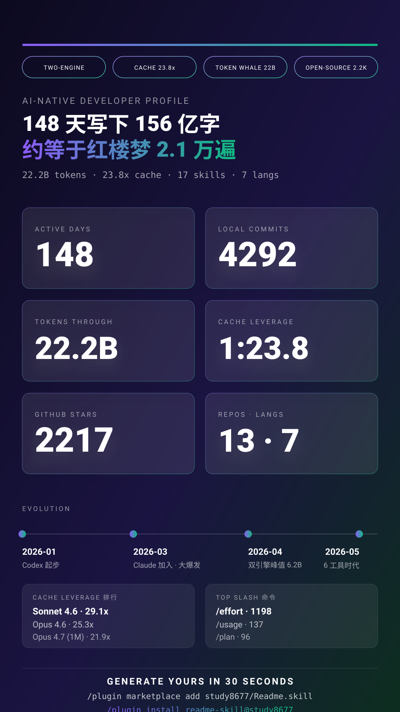

<div align="center">

# Readme.skill

### 30 秒，把你和 AI 协作的一切，变成一张能发朋友圈的开发者名片。

读取本地 Claude Code / Codex CLI / Kiro / Trae / Gemini Antigravity / Cursor 的真实使用数据，自动生成**对外可分享、默认脱敏**的 AI-Native 开发者画像 —— 一份长报告 + 一张竖屏海报。

[](https://github.com/study8677/Readme.skill/stargazers)
[](https://github.com/study8677/Readme.skill/network/members)
[](https://github.com/study8677/Readme.skill/issues)
[](./LICENSE)
[](./.claude-plugin/plugin.json)
[](https://www.ruanyifeng.com/blog/2026/05/weekly-issue-395.html)
[](https://linux.do/)

🌐 **中文** · [English](./README.en.md)　|　[📥 安装](#-30-秒装上) · [🎬 看效果](#-它长什么样) · [❓ FAQ](#-faq) · [🗺️ Roadmap](#-roadmap)

</div>

---

<p align="center">
  <a href="./examples/profile_20260528.md">
    
  </a>
</p>

<p align="center">
  <em>↑ v2.5.1 在作者电脑上跑出的最新真实输出（148 天 · 22.21B token · 23.8× cache leverage · 2,217★ · 4 个 AI 工具并用）。</em><br/>
  <em>点击图片查看完整 <a href="./examples/profile_20260528.md">中文 Markdown profile</a> · <a href="./examples/profile_20260528_en.md">English profile</a>。</em>
</p>

---

## ✨ 它能给你什么

- **一份长报告**（[示例](./examples/profile_20260515.md)）— 10 个维度叙事：AI-native 实践 / Cache leverage / Session 架构 / Token 经济学 / Evolution 曲线 / 项目领域 …
- **一张竖屏海报**（[示例 SVG](./examples/poster_20260515_zh.svg)）— 1080×1920，6 个英雄数字 + AI 自评金句 + 身份徽章 + 一键安装 CTA，社媒直发不丢人。
- **完全本地完成**：除调用 `gh` 拉你自己的 GitHub 公开贡献外，**0 联网、0 上传、0 写盘到 `~/.claude`**。
- **默认匿名**：项目名变 「项目 A/B/C」，私有仓变 `Private Repo X`，API key / token / 邮箱按 OWASP 正则清洗。
- **一句话触发**：装好后只要说「生成我的 AI 档案」，AI 自动跑完 9 个 Step。

## 🎯 谁会想用

| 你是 | 你能用它做什么 |
| --- | --- |
| **正在求职的开发者** | 在 GitHub profile 顶部放一张你跟 AI 协作的真实画像，**比简历的 "熟练使用 AI 工具" 强 100 倍** |
| **AI-Native 实践派** | 量化展示你的 cache leverage、多模型编排、自建 skill 数 —— 这些数字用面试讲不出来 |
| **年终复盘 / 周报困难户** | 跑一次，得到 149 天的活跃热力图 + Evolution 曲线，复盘材料一键齐 |
| **小红书 / 推特 / 微信 创作者** | 海报内置传播 3 件套（金句 + 徽章 + 安装 CTA），转发链路天然形成 |
| **团队 Tech Lead** | 让团队每人跑一份，了解大家的 AI 协作深度，找 best practice 而不是 best worker |

## ⚡ 30 秒装上

### 方式零：Claude Code Plugin（推荐 —— 两行命令）

在 Claude Code 里：

```
/plugin marketplace add study8677/Readme.skill
/plugin install readme-skill@study8677
```

Claude Code 自动发现 `skills/readme-skill/SKILL.md` 并挂载，无需手动 symlink。

### 方式一：Clone + 软链（Codex CLI 或不想用 plugin 的用户）

```bash
git clone https://github.com/study8677/Readme.skill.git
cd Readme.skill

# Claude Code 用户
mkdir -p ~/.claude/skills/readme-skill
ln -sf "$(pwd)/skills/readme-skill/SKILL.md" ~/.claude/skills/readme-skill/SKILL.md

# Codex CLI 用户
mkdir -p ~/.codex/skills/readme-skill
ln -sf "$(pwd)/skills/readme-skill/SKILL.md" ~/.codex/skills/readme-skill/SKILL.md
```

<details>
<summary>方式二、方式三（直接复制 / curl 一行装）</summary>

```bash
# 方式二：直接复制
git clone https://github.com/study8677/Readme.skill.git
mkdir -p ~/.claude/skills/readme-skill
cp Readme.skill/skills/readme-skill/SKILL.md ~/.claude/skills/readme-skill/
# Codex 同理：mkdir -p ~/.codex/skills/readme-skill && cp ... ~/.codex/skills/readme-skill/

# 方式三：一行 curl
mkdir -p ~/.claude/skills/readme-skill && curl -fsSL https://raw.githubusercontent.com/study8677/Readme.skill/main/skills/readme-skill/SKILL.md -o ~/.claude/skills/readme-skill/SKILL.md
# Codex: 把 ~/.claude 替换为 ~/.codex
```

</details>

## 🎬 怎么用

安装后在 Claude Code 或 Codex 的对话里说出以下任一句即可触发：

- 「生成我的 AI 档案」
- 「做一份 AI-native README」
- 「分析我的 Claude / Codex 使用情况」
- "build my AI usage profile"
- "summarize my Claude / Codex history"

AI 会跑完整套流程，把结果写到 `output/profile_<日期>.md` + `output/poster_<日期>_<lang>.svg`。中文提问出中文版，英文提问出英文版。

### 私人版 vs 分享版

- **默认（分享版）** — 项目名匿名为「项目 A/B/C」，私有仓库改为「Private Repo X」。
- **私人版** — 加一句「私人版 / 不要脱敏 / show real names」，AI 会保留真实名字（仍会脱敏 API key、邮箱）。

## 🌐 支持的 AI 编程工具

| 工具 | 状态 | 数据源 |
| --- | --- | --- |
| **Claude Code** | ✅ 完整支持 | `~/.claude/stats-cache.json` + `history.jsonl` + `projects/*/*.jsonl` + plans + skills + settings |
| **Codex CLI** | ✅ 完整支持 | `~/.codex/state_5.sqlite` (read-only) + `history.jsonl` + skills + automations + rules |
| **Kiro (AWS)** | ✅ v2.5 新增 | `~/.kiro/sessions/cli/*.{json,jsonl}` + `~/.local/share/kiro-cli/data.sqlite3` + `~/.kiro/{agents,skills,steering,prompts,settings}` |
| **Trae (ByteDance)** | ⚠️ v2.5 部分支持 | `~/Library/Application Support/Trae/User/{workspaceStorage,globalStorage}/state.vscdb`（chat 元数据，read-only）+ 项目 `.trae/{rules,skills}`。**token 用量走云端 API，本 skill 不联网，默认缺失** |
| **Gemini Antigravity (Google)** | ✅ v2.5 新增（社区 PR [#1](https://github.com/study8677/Readme.skill/pull/1) 贡献） | `~/.gemini/antigravity/brain/<uuid>/`：每个 task/session 的 `*.metadata.json` + `task.md` / `implementation_plan.md` / `walkthrough.md`。**token 不可得**，按 task/artifact 计数 + text-scale 估算（非计费） |
| **Cursor (Anysphere)** | ⚠️ v2.5.1 新增（部分支持） | `~/Library/Application Support/Cursor/User/{workspaceStorage,globalStorage}/state.vscdb` 的 `composer.*` / `aiService.*` keys（VS Code fork，同 Trae 架构）+ 项目 `.cursor/{rules,mcp.json}` / `.cursorrules`。**token 权威在云端 dashboard**，本地仅参考 |
| **GitHub** | ✅ 公开贡献 | `gh api graphql` —— 365 天 contributions、top repos、语言 |
| **本地 Git** | ✅ 完整支持 | 项目内只读 `git log`，统计 commit / +- 行数 |

> 用别的 AI IDE？欢迎提 Issue 告诉我数据路径，我会按同样模式接入。

## 📊 它长什么样

两份产物：

### 1. Markdown profile —— 长报告

10 个维度叙事，参考完整示例：[examples/profile_20260515.md](./examples/profile_20260515.md)

<details>
<summary>展开看 10 个维度结构</summary>

- 个人理念（来自 GitHub bio）
- 一览（关键数字 + velocity 指标）
- 🚀 Velocity & Leverage — AI 让你快了多少、广了多少
- 🤖 AI-Native 实践（多模型编排、高级能力、prompt caching、reasoning effort）
- 🔧 AI 基础设施 — 你造了什么工具给 AI 用
- 🛠️ AI 协作风格（slash 命令 + Session 架构）
- 📂 项目与领域分布（脱敏表 + 双工具编排模式）
- 🧬 Evolution 曲线 — AI 用法的成长弧线
- 💡 兴趣主题 & 关键词
- ⏱️ 工作节奏（24h 热力、连续活跃、峰值日）
- 💎 Token 经济学（cache leverage / 模型迁移 / 月度趋势）
- 💰 产出 & 投入（GitHub 优先，token 表降级到参考）

</details>

### 2. SVG 海报 —— 一张图传播

1080×1920 竖屏，**v2.4 链式传播版**自带 3 件套：

- **A. AI 自评金句**（双行大字，根据数据画像写出有人格的评价 —— 把 token 量换算成「等于 N 万遍《红楼梦》」）
- **B. 身份徽章**（顶部 4 胶囊：TWO-ENGINE / CACHE MASTER / SKILL BUILDER / POLYGLOT / TOKEN WHALE 等，自动判定）
- **C. 30 秒安装 CTA**（底部 install 命令 + 仓库 URL，让看到的人能立刻生成自己的）
- 6 个英雄数字 + Evolution 时间线 + Cache leverage 排行 + Top slash 命令
- 自动按提问语言选中/英：[中文版](./examples/example_poster_zh.svg) · [English](./examples/example_poster_en.svg)

#### 海报转 PNG（用于发社媒）

```bash
# 方式 1: rsvg-convert （需要 brew install librsvg）
rsvg-convert -h 1920 output/poster_*.svg > poster.png

# 方式 2: 用 Chrome / 浏览器
open output/poster_*.svg     # macOS 默认打开 → 右键另存为 PNG / 截图

# 方式 3: chromium headless
chromium --headless --screenshot=poster.png --window-size=1080,1920 output/poster_*.svg
```

## 🆚 跟同类项目有啥不同

| 项目 | 数据来源 | 输出 | 隐私 | 重点 |
| --- | --- | --- | --- | --- |
| **Readme.skill** | 本地 Claude/Codex 对话 + GitHub + git log | 长报告 + 海报 | 全本地 / 默认脱敏 | **AI 协作深度** |
| WakaTime | IDE 插件实时上报 | 网页 dashboard | 上传服务器 | 编程时长 |
| github-readme-stats | GitHub API | profile 卡片 | 公开数据 | 贡献量 |
| GitHub Skyline | GitHub 贡献日历 | 3D 模型 | 公开数据 | 视觉炫 |

简单说：**别的工具看你"写了多少代码"，Readme.skill 看你"怎么和 AI 一起写代码"**。

## 🛡️ 隐私承诺

- 全部数据采集发生在**本机**，除 `gh` 调用 GitHub 自身外不联网
- 对话正文（`message.content`）可被读取以增强关键词、协作风格、Session 架构分析，**但原文不会写进报告**
- 默认对项目名、私有仓库做匿名映射；按 OWASP-style 正则清洗 API key / token / webhook / 邮箱
- skill 不会修改 `~/.claude` 或 `~/.codex` 下任何文件（SQLite 用 `mode=ro&immutable=1` 打开）
- 报告生成后写到当前目录的 `./output/`，**你随时可以 `rm` 或全文搜查**

## 🗺️ Roadmap

- **v2.5（已发布）** — ✅ Kiro (AWS) / Trae (ByteDance) 适配（[#2](https://github.com/study8677/Readme.skill/issues/2)），现已支持 4 个 AI 编程工具；Weekly Recap 模式与首页 Community Gallery 持续迭代
- **v2.6** — `--diff` 跟上次报告对比模式；里程碑徽章（BILLION CLUB / 10K STARS）
- **v3.0** — 让 skill 自己学：根据用户反馈调整叙事 tone

想看哪个先做？[去 Issue 投票](https://github.com/study8677/Readme.skill/issues) 或者 [开 Discussion](https://github.com/study8677/Readme.skill/discussions)。

## 🤝 想贡献？

- **跑出有趣画像** → 截图发 [Discussions › Show your profile](https://github.com/study8677/Readme.skill/discussions)，会被收入主页 Gallery
- **支持别的 AI 工具** → 提 Issue 告诉我数据路径，照 [SKILL.md Step 2/3](./skills/readme-skill/SKILL.md) 的范式 PR
- **改进金句 / 徽章逻辑** → 直接改 [SKILL.md Step 8b](./skills/readme-skill/SKILL.md) 里的 Tone A-F 或徽章触发条件
- **翻译成你的语言** → 目前有中英文，欢迎日 / 韩 / 葡 / 西 PR

## ❓ FAQ

<details>
<summary><b>会上传我的对话记录吗？</b></summary>

不会。整个 skill 是**只读 + 本地**：除了 `gh` 调用 GitHub 自身（你已经登录的账号），不发任何网络请求。SQLite 都用 `mode=ro&immutable=1` 打开，物理上不可写。

</details>

<details>
<summary><b>没用过 Codex 怎么办？</b></summary>

没问题。skill 内置降级策略：没有 `~/.codex/state_5.sqlite` 就跳过 Codex 章节，只用 Claude 数据生成。报告照样能跑。

</details>

<details>
<summary><b>生成出来的项目名我不想让人看见</b></summary>

默认就是脱敏的。项目变「项目 A/B/C」，私有仓变 `Private Repo X`。如果你想要真名，加一句「私人版」。

</details>

<details>
<summary><b>能不能不用 Claude Code，直接用 ChatGPT / Cursor 跑？</b></summary>

理论上可以 —— SKILL.md 是 markdown 写的 AI 指令集，**任何能调用文件读取和 shell 工具的 agent 都能跑**。但目前只在 Claude Code 和 Codex CLI 上充分测试过。欢迎拿去其他 agent 试，结果发我 issue。

</details>

<details>
<summary><b>跑一次大概多久？</b></summary>

一般 2-5 分钟。主要耗时在 `gh api graphql` 拉 GitHub 数据 + Claude 在大量 jsonl 上做 jq 聚合。生成海报需要额外 20-40 秒。

</details>

<details>
<summary><b>为啥要做成 skill 而不是 Python 脚本？</b></summary>

因为脚本会僵化。Skill = 给 AI 的指令集 —— AI 会按当前数据动态权衡叙事重心，写出每次都不一样、但都贴合真实数据的报告。如果换成 Python，输出永远是套模板。详见 [SKILL.md 设计理念](./skills/readme-skill/SKILL.md)。

</details>

## 💌 致谢 & 友链

- 🎉 2026-05-08 入选 [阮一峰《科技爱好者周刊》第 395 期](https://www.ruanyifeng.com/blog/2026/05/weekly-issue-395.html)「AI 相关」板块 —— 感谢阮老师！
- 🐧 在 [Linux Do](https://linux.do/) 收获大量反馈与早期种子用户
- 💜 致敬 Claude Code 团队和 Codex CLI 团队，让这种"AI 自我描述"成为可能

## ⭐ Star history

[](https://star-history.com/#study8677/Readme.skill&Date)

## 📜 协议

[MIT](./LICENSE) —— 拿去随便用，记得改成自己仓库名。

---

<div align="center">

**用过觉得有用？给个 ⭐ 是对作者最大的鼓励。**

[⬆ 回到顶部](#readmeskill) · [📥 装一个](#-30-秒装上) · [💬 提 Issue](https://github.com/study8677/Readme.skill/issues) · [💡 开 Discussion](https://github.com/study8677/Readme.skill/discussions)

</div>
